# PDF Slides Deduplicator

For a lecture on model checking at my university, the institute made LaTeX-style
slides and lost the original source code some time ago.
Therefore the slides are stuck in presenter mode, which is a bit annoying when
looking things up, due to the redundancy of the content.

I've therefore written this generic PDF deduplicator, which removes any 
intermediary slides that only add content.
It's not extensively tested, but it should work on all LaTeX style slides with
the default theme.


## Try it yourself

Install the prerequisites for Python 3:

```sh
pip3 install pypdf2 pdf2image Pillow
brew install poppler # may be needed by Pillow/OS X
```

Download the original slides:

```sh
curl -s https://moves.rwth-aachen.de/teaching/ss-18/introduction-to-model-checking | \
	ack -o "\"(https.*?lec.*?\.pdf)\"" | \
	xargs wget
```

Deduplicate the hell out of them:

```
 ./deduplicate.py --mask "0.92,0.95,1,1" lec1.pdf lec2.pdf lec3.pdf lec4.pdf \
                                         lec5.pdf lec6.pdf lec7.pdf
lec1.pdf          0 ( 0%) slides removed:  52 ->  52
lec2.pdf         71 (58%) slides removed: 121 ->  50
lec3.pdf         61 (53%) slides removed: 113 ->  52
lec4.pdf         65 (47%) slides removed: 136 ->  71
lec5.pdf        100 (49%) slides removed: 202 -> 102
lec6.pdf        113 (67%) slides removed: 167 ->  54
lec7.pdf         94 (59%) slides removed: 159 ->  65
Total: 504 (53%) slides removed: 950 -> 446
```

## Algorithm

1. render each PDF slide into an *grayscale image* at `--dpi=150` resolution
2. *detect the edges* to get rid of the background
3. `--mask="x1,y1,x2,y2"` out anything that changes every slide (like page numbers)
4. compute the *edge difference* between the last two slides
5. *logically AND* this difference with the current collection image
6. if *more than `--threshold=0.05` collisions*: set current image as new collection image, *include prev. slide*
7. otherwise: *add edge difference* on current reference image, *remove prev. slide*


#### Example

Here are the image states for slides 2-9 from lecture 2.

| Input | Edges | Difference | Collector | Collisions |
|:-:|:-:|:-:|:-:|:-:|
| 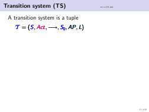 | 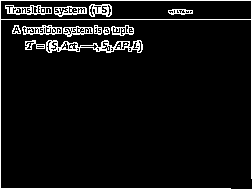 | 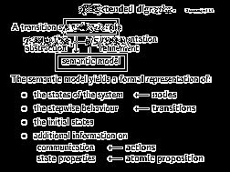 | 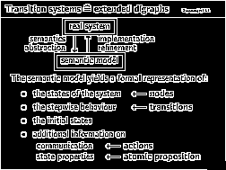 | 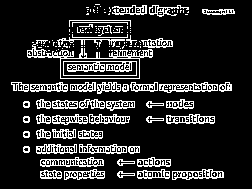 |
| 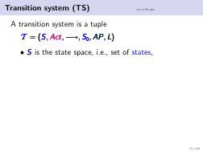 | 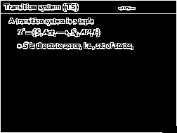 | 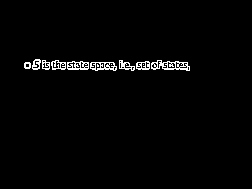 |  |  |
| 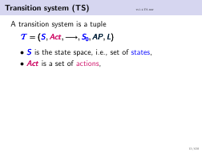 | 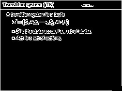 | 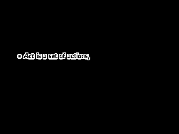 |  | 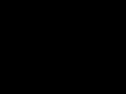 |
| 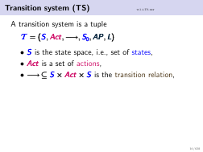 | 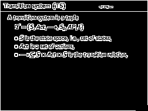 | 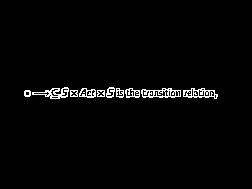 |  |  |
| 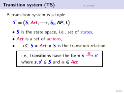 | 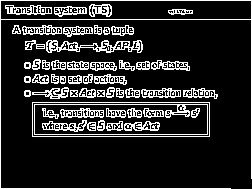 | 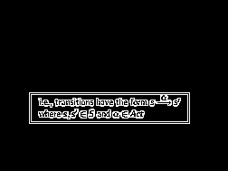 |  |  |
| 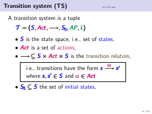 | 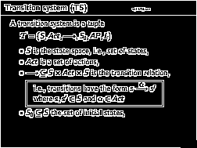 | 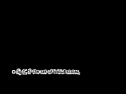 |  |  |
| 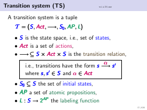 | 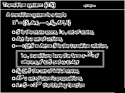 | 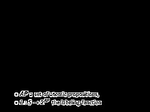 |  |  |
| 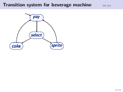 | 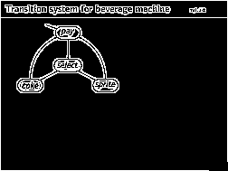 | 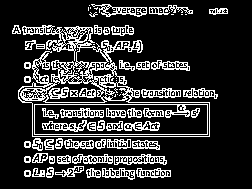 |  | 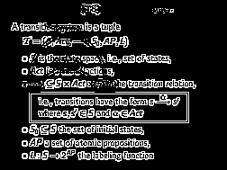 |


## CLI

```
 $ ./deduplicate.py --help
usage: deduplicate.py [-h] [--dpi DPI] [--suffix SUFFIX]
                      [--threshold THRESHOLD] [--mask MASKS]
                      slides [slides ...]

Deduplicate PDF slides

positional arguments:
  slides                The PDF slides to deduplicate.

optional arguments:
  -h, --help            show this help message and exit
  --dpi DPI             DPI resolution to perform the diff with.
  --suffix SUFFIX       Suffix appended to the deduplicated slide.
  --threshold THRESHOLD
                        Maximum difference between slides to be considered the
                        same slide.
  --mask MASKS          Mask out differences in parts of the slide:
                        `x1,y1,x2,y2`. Example: `--mask "0.92,0.96,1.0,1.0"`
                        (lower right corner).
```


## License

This work is licensed under the BSD 3-clause license.

> Copyright 2019 Niklas Hauser
> 
> Redistribution and use in source and binary forms, with or without modification, 
> are permitted provided that the following conditions are met:
> 
> 1. Redistributions of source code must retain the above copyright notice, this 
> list of conditions and the following disclaimer.
> 
> 2. Redistributions in binary form must reproduce the above copyright notice, 
> this list of conditions and the following disclaimer in the documentation and/or 
> other materials provided with the distribution.
> 
> 3. Neither the name of the copyright holder nor the names of its contributors 
> may be used to endorse or promote products derived from this software without 
> specific prior written permission.
> 
> THIS SOFTWARE IS PROVIDED BY THE COPYRIGHT HOLDERS AND CONTRIBUTORS "AS IS" 
> AND ANY EXPRESS OR IMPLIED WARRANTIES, INCLUDING, BUT NOT LIMITED TO, THE 
> IMPLIED WARRANTIES OF MERCHANTABILITY AND FITNESS FOR A PARTICULAR PURPOSE 
> ARE DISCLAIMED. IN NO EVENT SHALL THE COPYRIGHT HOLDER OR CONTRIBUTORS BE 
> LIABLE FOR ANY DIRECT, INDIRECT, INCIDENTAL, SPECIAL, EXEMPLARY, OR 
> CONSEQUENTIAL DAMAGES (INCLUDING, BUT NOT LIMITED TO, PROCUREMENT OF SUBSTITUTE 
> GOODS OR SERVICES; LOSS OF USE, DATA, OR PROFITS; OR BUSINESS INTERRUPTION) 
> HOWEVER CAUSED AND ON ANY THEORY OF LIABILITY, WHETHER IN CONTRACT, STRICT 
> LIABILITY, OR TORT (INCLUDING NEGLIGENCE OR OTHERWISE) ARISING IN ANY WAY 
> OUT OF THE USE OF THIS SOFTWARE, EVEN IF ADVISED OF THE POSSIBILITY OF SUCH DAMAGE.
